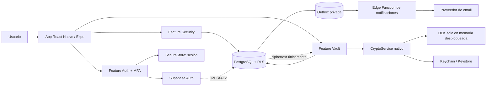
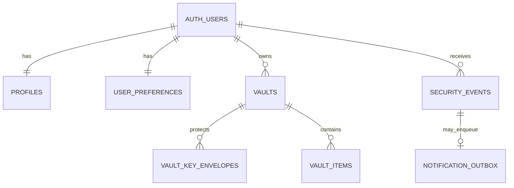

# My Keys — Fase 0: diseño técnico

**Estado:** aprobado; Fase 1 iniciada  
**Fecha:** 8 de septiembre de 2026  
**Alcance:** diseño únicamente; no inicia la Fase 1

> **Enmienda de Fase 1 (9 de septiembre de 2026):** el cliente principal cambia de
> React Native/Expo a Kotlin Multiplatform con Compose Multiplatform. Android usa Jetpack
> Compose. Se mantienen las reglas criptográficas y de backend de este diseño; las menciones
> posteriores a Expo describen la propuesta original y quedan reemplazadas, para el cliente,
> por la [arquitectura KMP aprobada](../02-fase-1-base/KMP-ARCHITECTURE.md).

## 0. Resumen ejecutivo y decisiones que cambian la especificación

My Keys será una aplicación React Native/Expo para Android e iOS que sincroniza únicamente ciphertext y metadatos mínimos mediante Supabase. El contenido del vault se cifra y descifra en el dispositivo. Supabase Auth gestiona la cuenta, el email, las sesiones y TOTP; PostgreSQL con RLS aplica el aislamiento entre usuarios y exige `aal2` para acceder a cualquier dato de usuario.

### Esta especificación debería modificarse por seguridad: separar las dos contraseñas

La contraseña enviada a Supabase Auth no debe ser la misma que deriva la clave del vault. Si se reutilizara, un backend de autenticación malicioso o comprometido podría capturarla durante un login y usar el `salt`, los parámetros KDF y la DEK envuelta almacenados para intentar abrir el vault.

Se definen dos secretos independientes:

- **Contraseña de acceso:** se envía por TLS a Supabase Auth. Supabase la procesa y almacena según su sistema de autenticación. No cifra el vault.
- **Contraseña maestra del vault:** nunca sale del dispositivo. Se usa exclusivamente con Argon2id para derivar la KEK que envuelve la DEK.

Durante el alta se pide primero la contraseña de acceso y, después de verificar email y TOTP, se crea una contraseña maestra distinta. La aplicación debe impedir que ambas sean iguales durante el onboarding inicial y debe explicar la diferencia. En dispositivos confiables, la biometría evita introducir la contraseña maestra en cada desbloqueo.

Consecuencias positivas:

- Restablecer la contraseña de acceso no altera el cifrado del vault.
- Supabase nunca recibe el secreto con el que se deriva la KEK.
- Una filtración de Supabase Auth y de la base de datos no entrega directamente la contraseña maestra.
- El Recovery Key se usa cuando se olvida la contraseña maestra, no como sustituto de la recuperación de la cuenta o del MFA.

Coste: un paso adicional de onboarding y dos secretos conceptuales. Se acepta porque la regla del proyecto prioriza seguridad sobre comodidad.

### Esta especificación debería modificarse por seguridad: no descargar Recovery Key en texto plano por defecto

El MVP mostrará la frase de recuperación una sola vez, permitirá copiarla y recomendará escribirla o guardarla en un gestor/soporte fuera de línea. No creará automáticamente un TXT, PDF o captura: esas copias suelen quedar en Descargas, copias en la nube o historiales. Una exportación cifrada y una hoja imprimible explícita podrán añadirse después con advertencia y reautenticación.

### Límite honesto de “zero knowledge”

El diseño protege frente a una filtración de base de datos, un usuario malicioso, el operador de Supabase que solo observa datos almacenados y las Edge Functions normales. No protege frente a una versión maliciosa de la propia app, un dispositivo rooteado/jailbroken comprometido mientras el vault está desbloqueado, un keylogger ni una captura de pantalla externa. El servidor también ve metadatos mínimos: identidad de cuenta, número aproximado de registros, tamaños de ciphertext y fechas.

## 1. Resumen funcional

El MVP cubre:

- Alta, verificación de email, login, logout y recuperación de contraseña de acceso.
- TOTP obligatorio mediante Supabase Auth; el acceso a datos exige JWT con `aal2`.
- Creación del vault, contraseña maestra y Recovery Key de 256 bits.
- CRUD de elementos cifrados, búsqueda local, favoritos, categorías y papelera.
- Generador de contraseñas con CSPRNG.
- Bloqueo por inactividad y desbloqueo biométrico local.
- Copiado controlado y limpieza best-effort del portapapeles.
- Perfil, preferencias, sesiones soportadas por Supabase y eliminación de cuenta.
- Eventos y emails de seguridad sin contenido del vault.
- Security Center inicial calculado localmente.

No forman parte del MVP: compartir vaults, passkeys, autofill del sistema, extensión, adjuntos, importación masiva, historial criptográfico completo y modo offline con escritura.

## 2. Arquitectura propuesta

### 2.1 Capas

1. **Presentación:** Expo Router, pantallas finas y componentes accesibles.
2. **Aplicación:** casos de uso (`signIn`, `unlockVault`, `createVaultItem`, `rotateRecoveryKey`) sin dependencias visuales.
3. **Dominio:** entidades, invariantes, errores tipados y puertos de repositorio/criptografía.
4. **Infraestructura móvil:** Supabase JS, SecureStore, LocalAuthentication, Crypto, Clipboard y Linking.
5. **Backend:** Supabase Auth, Postgres, RLS, funciones SQL estrechas y Edge Functions.
6. **Servicios externos:** proveedor SMTP transaccional; solo recibe email y plantilla genérica.

Reglas de dependencia:

- UI depende de aplicación; aplicación depende de dominio.
- Dominio no importa Expo, React Native ni Supabase.
- Infraestructura implementa puertos del dominio.
- Ningún módulo fuera de `crypto` manipula claves en formato binario.
- Ningún logger acepta objetos de sesión, payloads del vault o errores crudos del proveedor.

### 2.2 Diagrama de componentes



### 2.3 Fronteras de confianza

- **Confiable mientras está desbloqueado:** proceso de la app y módulos criptográficos del dispositivo.
- **Confiable para custodia local:** Keychain/Keystore mediante SecureStore, sujeto a las garantías del SO.
- **No confiable para confidencialidad del vault:** red, Supabase, Postgres, Edge Functions, backups y SMTP.
- **Confiable para autenticación/autorización, no para secreto del vault:** Supabase Auth.
- **Entrada no confiable:** todo dato remoto, deep link, URL, QR, formulario y registro de base de datos.

## 3. Modelo de amenazas

### 3.1 Activos

- Payloads descifrados y DEK.
- Contraseña maestra y Recovery Key.
- Contraseña de acceso, TOTP, tokens de sesión y sesiones activas.
- Integridad y disponibilidad del vault.
- Email, preferencias y metadatos de seguridad.

### 3.2 Adversarios y controles

**Filtración de Postgres o backups**

- Solo expone ciphertext, nonces, envolturas de DEK, salts, parámetros KDF y metadatos.
- Argon2id frena ataques contra la contraseña maestra; una contraseña fuerte sigue siendo obligatoria.
- Recovery Key de 256 bits no es viable de forzar.

**Usuario autenticado que altera `user_id`/`vault_id`**

- RLS usa `auth.uid()` y pertenencia al vault en cada operación.
- `WITH CHECK` impide insertar o mover filas hacia otro propietario.
- `vault_items` no acepta un `user_id` redundante manipulable.
- La service role nunca está en la app.

**Robo de teléfono bloqueado**

- Sesión y clave local se guardan en Keychain/Keystore.
- Biometría fuerte cuando exista; bloqueo automático; DEK borrada best-effort al bloquear.
- Un dispositivo sin bloqueo seguro no puede habilitar desbloqueo biométrico.

**Dispositivo comprometido mientras está desbloqueado**

- Riesgo no eliminable por una app móvil. Se minimiza el tiempo en memoria, se impiden capturas en pantallas sensibles donde la plataforma lo permita y no se registran secretos.

**Backend/administrador malicioso**

- No conoce la contraseña maestra ni el Recovery Key.
- Puede borrar, retener o devolver ciphertext antiguo; AEAD detecta alteración, pero no garantiza por sí sola frescura global.
- No existe clave maestra de administrador.

**Supply chain**

- Lockfile obligatorio, actualizaciones controladas, SBOM, revisión de dependencias y builds reproducibles cuando sea posible.
- El módulo Argon2/libsodium se fija a una versión auditada; no se implementan primitivas propias.

**Email comprometido**

- Permite intentar restablecer la contraseña de acceso, pero no abre el vault sin contraseña maestra o Recovery Key y MFA.

**TOTP perdido**

- La Recovery Key no omite MFA. Se recomienda registrar un segundo factor TOTP en otro dispositivo.
- Un eventual proceso de recuperación MFA deberá ser independiente y no tendrá capacidad para descifrar el vault.

### 3.3 No objetivos del MVP

- Ocultar por completo tamaños, frecuencia de uso, fechas o número de elementos.
- Proteger un vault abierto frente a malware con control del SO.
- Evitar denegación de servicio o rollback realizado por el backend sin un log externo verificable.
- Sustituir una auditoría criptográfica profesional previa a producción.

## 4. Modelo criptográfico

### 4.1 Primitivas y versiones

- **DEK:** 32 bytes aleatorios por vault.
- **KEK de contraseña maestra:** Argon2id, salida de 32 bytes.
- **KEK de recuperación:** HKDF-SHA-256 desde una semilla aleatoria de 32 bytes.
- **AEAD:** AES-256-GCM con nonce aleatorio de 12 bytes y tag de 16 bytes.
- **RNG:** APIs nativas asíncronas; nunca `Math.random()` ni la API síncrona que pueda degradarse en depuración.
- **Codificación de texto:** UTF-8 exacto. La contraseña no se recorta ni normaliza silenciosamente.
- **Versionado:** cada ciphertext guarda `crypto_version`, algoritmo y versión de esquema del payload.

Parámetro inicial para Argon2id: `m=65536 KiB`, `t=3`, `p=4`, salt aleatorio de 16 bytes, salida de 32 bytes. Antes de congelarlo en producción debe medirse en el dispositivo Android mínimo soportado y en iPhone; objetivo aproximado: 750–1500 ms sin OOM. Los parámetros exactos se almacenan por envoltura para poder migrarlos. Nunca se reducen automáticamente sin una decisión versionada.

Implementación: Expo Development Build/CNG y un módulo Expo local mínimo que vincula una versión fijada de libsodium para `crypto_pwhash(..., ARGON2ID13)` y HKDF. La integración nativa se somete a vectores RFC y auditoría; no reimplementa Argon2. AES-GCM y CSPRNG se obtienen de `expo-crypto`.

### 4.2 Envolvente criptográfica

La DEK no cifra directamente todos los contextos. En v1 se utiliza así:

- La DEK cifra payloads de `vault_items`.
- La KEK de contraseña cifra una copia de la DEK.
- La KEK de recuperación cifra otra copia independiente de la misma DEK.
- Cada cifrado usa nonce nuevo y AAD específico.

AAD para elementos, serializado en UTF-8 con campos de longitud fija/separadores no ambiguos:

```text
mykeys:item:v1 | vault_id | item_id | payload_schema_version
```

AAD para envolturas:

```text
mykeys:dek-wrap:v1 | vault_id | envelope_id | wrapper_type | kdf_algorithm
```

La AAD impide mover un ciphertext válido a otro elemento, vault o tipo de envoltura sin que falle la autenticación GCM.

### 4.3 Payload cifrado

Todo lo que revele el servicio se mantiene dentro del JSON cifrado:

```json
{
  "type": "login",
  "name": "Google",
  "username": "usuario@gmail.com",
  "password": "...",
  "websiteUrl": "https://google.com",
  "notes": "...",
  "category": "Personal",
  "favorite": true,
  "passwordChangedAt": "2026-09-08T10:00:00.000Z"
}
```

Límites validados antes de cifrar: nombre 1–200 caracteres, usuario 0–320, contraseña 1–4096 bytes, URL 0–2048, notas 0–20000 y categoría 0–100. El ciphertext completo tendrá un máximo inicial de 64 KiB.

### 4.4 Dónde se cifra y descifra cada dato

**En el dispositivo, antes de red:** payload completo del elemento, metadatos privados del vault y DEK bajo cada KEK.

**En el dispositivo, después de descarga y de desbloquear:** DEK, payloads y análisis del Security Center. La búsqueda se hace sobre modelos descifrados en memoria.

**Nunca se cifra por el backend porque nunca recibe plaintext:** nombre, usuario, contraseña, URL, notas, categoría y favorito.

**Permanece en claro en Postgres por necesidad operativa:** UUIDs, propietario del vault, timestamps, estado de papelera, revisión, versión de cifrado, tamaños implícitos y tipos de evento genéricos.

**Solo local:** preferencia biométrica del dispositivo, clave de desbloqueo del dispositivo, DEK en memoria y contenido temporal mostrado/copied.

### 4.5 Gestión de memoria

- Las claves se mantienen en `Uint8Array`, no en strings, salvo límites inevitables de APIs.
- Al bloquear, cerrar sesión o ir a segundo plano, se sobrescriben buffers conocidos y se eliminan referencias.
- JavaScript/Hermes y su GC pueden dejar copias temporales; el borrado es best-effort, no una garantía formal.
- No se guardan payloads descifrados en Zustand persistido, AsyncStorage, SQLite, crash reports o cachés de navegación.

## 5. Flujos de identidad, MFA y vault

### 5.1 Registro

```mermaid
sequenceDiagram
    participant U as Usuario
    participant A as App
    participant S as Supabase Auth
    participant D as Postgres
    U->>A: Email + contraseña de acceso + confirmación
    A->>S: signUp
    S-->>U: Email de verificación
    U->>A: Deep link verificado
    A->>S: Sesión AAL1
    A->>S: enroll TOTP
    S-->>A: QR/secret temporal
    U->>A: Código TOTP
    A->>S: challenge + verify
    S-->>A: JWT AAL2
    A->>A: Crear contraseña maestra distinta
    A->>A: Generar DEK + Recovery Key; crear 2 envolturas
    A->>D: Crear vault y envolturas (AAL2 + RLS)
    A-->>U: Mostrar Recovery Key una vez
    U->>A: Confirmar palabras solicitadas
```

Si se abandona el proceso antes de crear el vault, el siguiente login reanuda el onboarding después de alcanzar AAL2. Un trigger sobre `auth.users` crea `profiles` y `user_preferences`; el cliente no necesita escribir a AAL1.

### 5.2 Login y desbloqueo

1. La app envía email y contraseña de acceso a `signInWithPassword`.
2. Obtiene sesión AAL1 y consulta `getAuthenticatorAssuranceLevel()`.
3. Si `currentLevel=aal1` y `nextLevel=aal2`, lista factores verificados y muestra desafío.
4. `challenge` + `verify` emite sesión AAL2.
5. Solo entonces RLS permite leer vault y envolturas.
6. El usuario introduce la contraseña maestra; Argon2id deriva KEK y descifra la DEK.
7. La app prueba la DEK descifrando una envoltura/metadata autenticada. Un fallo se presenta como contraseña incorrecta o datos dañados sin filtrar detalles.
8. La DEK vive en memoria hasta el bloqueo. En dispositivo confiable, biometría puede recuperar la clave local y evitar el paso 6.

La UI nunca es el control de MFA principal: RLS contiene una política restrictiva `aal='aal2'`.

### 5.3 Alta TOTP

1. Requiere sesión AAL1 autenticada y email confirmado.
2. `mfa.enroll({factorType:'totp'})` crea factor no verificado y devuelve URI/QR/secret.
3. La app renderiza el QR localmente; no lo envía a analítica ni captura logs.
4. El usuario introduce seis dígitos.
5. La app ejecuta `challenge` y `verify`.
6. Supabase marca el factor verificado, cierra otras sesiones según su comportamiento y eleva la actual a AAL2.
7. Se refresca la sesión y se confirma `currentLevel=aal2` antes de continuar.
8. Se registra `MFA_ENABLED` por un flujo servidor confiable, sin secret ni código.

Desactivar un factor exige AAL2 y una verificación TOTP reciente. Si es el último factor, la política del producto impide desactivarlo hasta registrar otro, salvo un proceso de recuperación MFA separado.

### 5.4 Recovery Key

1. Generar 32 bytes con CSPRNG.
2. Codificarlos como frase BIP39 de 24 palabras con checksum usando una lista fijada y normalización definida por el estándar.
3. Derivar `recovery_KEK = HKDF-SHA-256(seed, recovery_salt, info-vault, 32)`.
4. Envolver DEK con AES-256-GCM, nonce nuevo y AAD de tipo `recovery_key`.
5. Subir solo la envoltura, nonce, salt, algoritmos y versiones.
6. Mostrar la frase una sola vez y pedir palabras aleatorias para confirmar que fue guardada.
7. Borrar seed/frase de memoria best-effort al finalizar.

HKDF, no Argon2id, es apropiado aquí porque la frase se genera con 256 bits de entropía; no es una contraseña humana. Argon2 añadiría latencia sin una mejora material frente a fuerza bruta.

En Ajustes, “Recovery Key” permite **rotar** la clave después de reautenticar; no vuelve a revelar la anterior. La rotación crea una nueva envoltura verificada y retira la antigua.

### 5.5 Recuperar vault

1. Recuperar primero el acceso a la cuenta y completar TOTP/AAL2.
2. Introducir la frase de recuperación localmente.
3. Validar checksum, derivar KEK de recuperación y abrir la envoltura de DEK.
4. Pedir una nueva contraseña maestra, distinta de la contraseña de acceso conocida en ese flujo.
5. Derivar nueva KEK Argon2id, crear y probar nueva envoltura de contraseña.
6. Activar la nueva envoltura en una transacción y retirar la anterior.
7. Rotar también Recovery Key por defecto, mostrarla una vez y registrar `RECOVERY_USED`.

Ni Recovery Key ni contraseña maestra se envían al servidor.

### 5.6 Cambio de contraseña de acceso

1. Requiere AAL2, comprobación de sesión reciente y el mecanismo de cambio seguro de Supabase (contraseña actual o nonce de reautenticación según configuración).
2. `auth.updateUser({password, nonce})` cambia únicamente Supabase Auth.
3. Se revocan otras sesiones cuando corresponda y se registra/email `PASSWORD_CHANGED` sin datos sensibles.
4. La DEK y sus envolturas no cambian.

### 5.7 Cambio de contraseña maestra

1. Requiere vault abierto, AAL2 y TOTP reciente.
2. Verifica la contraseña maestra actual abriendo la envoltura activa, aunque la DEK ya esté en memoria por biometría.
3. Deriva nueva KEK Argon2id con salt nuevo y crea envoltura `pending`.
4. La abre localmente y valida la misma DEK.
5. Activa la nueva envoltura y retira la anterior mediante RPC transaccional.
6. Mantiene la envoltura de recuperación sin cambios.
7. Borra secretos temporales y notifica genéricamente.

Si hay un fallo entre pasos, la envoltura activa anterior sigue funcionando. El cliente puede detectar y limpiar envolturas `pending` verificadas.

### 5.8 Biometría y bloqueo automático

- Al habilitar biometría se genera una clave aleatoria específica del dispositivo.
- La clave se guarda en Keychain/Keystore con autenticación de usuario y biometría fuerte (`strong` en Android cuando sea posible).
- Una copia local de la DEK se envuelve con esa clave. No se guarda la contraseña maestra.
- Cambiar la biometría del sistema puede invalidar la entrada; la app vuelve a pedir la contraseña maestra.
- Al expirar el temporizador o pasar a background según política, la app destruye el estado descifrado y vuelve a la pantalla de desbloqueo.

### 5.9 Portapapeles

- Copiar exige vault desbloqueado; mostrar confirmación discreta.
- Al vencer 15/30/60 segundos, limpiar solo si el contenido sigue coincidiendo con el valor colocado por My Keys, cuando la plataforma permita leerlo sin empeorar privacidad.
- En plataformas que no permitan una limpieza fiable en background, se documenta como best-effort.
- “Nunca” existe, pero muestra advertencia.

## 6. Modelo de datos lógico

Se añaden `vaults` y `vault_key_envelopes` en lugar de concentrar todo en `vault_settings`:

- `vaults` establece una frontera de autorización y evita una migración destructiva al añadir varios vaults.
- `vault_key_envelopes` admite varias formas de envolver la DEK, rotación atómica y versionado.

Entidades:

- `auth.users`: identidad y autenticación gestionadas por Supabase.
- `profiles`: datos públicos/visibles del propio perfil, sin duplicar email.
- `user_preferences`: preferencias sincronizables no secretas.
- `vaults`: propiedad y metadatos mínimos de cada vault.
- `vault_key_envelopes`: DEK cifrada bajo contraseña o Recovery Key.
- `vault_items`: payloads de secretos cifrados y estado de sincronización/papelera.
- `security_events`: auditoría genérica e inmutable visible al usuario.
- `private.notification_outbox`: cola servidor-servidor para emails; no está expuesta a la app.



## 7. Diseño PostgreSQL exacto

Los nombres de constraints se fijarán en migraciones. Tipos de evento y wrapper se implementan inicialmente con `text + CHECK` para facilitar migraciones; pueden convertirse a enums cuando el catálogo se estabilice.

### 7.1 `public.profiles`

```sql
create table public.profiles (
  id uuid primary key references auth.users(id) on delete cascade,
  display_name text null check (char_length(display_name) between 1 and 80),
  notifications_enabled boolean not null default true,
  created_at timestamptz not null default now(),
  updated_at timestamptz not null default now()
);
```

Objetivo: información mínima de perfil. El email no se duplica. Índice adicional innecesario en MVP porque la PK cubre las consultas.

### 7.2 `public.user_preferences`

```sql
create table public.user_preferences (
  user_id uuid primary key references auth.users(id) on delete cascade,
  theme text not null default 'system'
    check (theme in ('system', 'light', 'dark')),
  locale text not null default 'es-ES'
    check (char_length(locale) between 2 and 16),
  auto_lock_seconds integer not null default 300
    check (auto_lock_seconds in (0, 60, 300, 900, 1800)),
  clipboard_clear_seconds integer null default 30
    check (clipboard_clear_seconds is null or clipboard_clear_seconds in (15, 30, 60)),
  created_at timestamptz not null default now(),
  updated_at timestamptz not null default now()
);
```

`NULL` en `clipboard_clear_seconds` significa “Nunca”. La biometría no se sincroniza porque es específica de cada dispositivo.

### 7.3 `public.vaults`

```sql
create table public.vaults (
  id uuid primary key,
  owner_user_id uuid not null default auth.uid()
    references auth.users(id) on delete cascade,
  vault_type text not null default 'personal'
    check (vault_type in ('personal')),
  encrypted_metadata bytea null,
  metadata_nonce bytea null check (metadata_nonce is null or octet_length(metadata_nonce) = 12),
  crypto_version smallint not null default 1 check (crypto_version > 0),
  created_at timestamptz not null default now(),
  updated_at timestamptz not null default now(),
  check ((encrypted_metadata is null) = (metadata_nonce is null))
);

create unique index vaults_one_personal_per_owner
  on public.vaults(owner_user_id)
  where vault_type = 'personal';
```

El `id` se genera en el cliente con CSPRNG antes de cifrar AAD. `encrypted_metadata` permitirá un nombre privado sin crear columna de texto plano.

### 7.4 `public.vault_key_envelopes`

```sql
create table public.vault_key_envelopes (
  id uuid primary key,
  vault_id uuid not null references public.vaults(id) on delete cascade,
  wrapper_type text not null
    check (wrapper_type in ('master_password', 'recovery_key')),
  state text not null default 'pending'
    check (state in ('pending', 'active', 'retired')),
  wrapped_dek bytea not null check (octet_length(wrapped_dek) between 33 and 256),
  nonce bytea not null check (octet_length(nonce) = 12),
  kdf_salt bytea not null check (octet_length(kdf_salt) between 16 and 32),
  kdf_algorithm text not null
    check (kdf_algorithm in ('argon2id-v1', 'hkdf-sha256-v1')),
  kdf_parameters jsonb not null,
  cipher_algorithm text not null default 'aes-256-gcm'
    check (cipher_algorithm = 'aes-256-gcm'),
  crypto_version smallint not null default 1 check (crypto_version > 0),
  created_at timestamptz not null default now(),
  activated_at timestamptz null,
  retired_at timestamptz null
);

create index vault_key_envelopes_vault_state
  on public.vault_key_envelopes(vault_id, wrapper_type, state);

create unique index vault_key_envelopes_one_active_type
  on public.vault_key_envelopes(vault_id, wrapper_type)
  where state = 'active';
```

Checks adicionales en migración validarán la forma JSON de parámetros:

- `argon2id-v1`: `memory_kib`, `iterations`, `parallelism`, `output_bytes=32` dentro de límites aprobados.
- `hkdf-sha256-v1`: `output_bytes=32`, `info_version=1`.

La app tendrá `SELECT` e `INSERT`; la activación/retiro se hace con RPC transaccional de privilegios controlados. No se concede `DELETE` directo.

### 7.5 `public.vault_items`

```sql
create table public.vault_items (
  id uuid primary key,
  vault_id uuid not null references public.vaults(id) on delete cascade,
  encrypted_payload bytea not null
    check (octet_length(encrypted_payload) between 17 and 65536),
  nonce bytea not null check (octet_length(nonce) = 12),
  cipher_algorithm text not null default 'aes-256-gcm'
    check (cipher_algorithm = 'aes-256-gcm'),
  crypto_version smallint not null default 1 check (crypto_version > 0),
  payload_schema_version smallint not null default 1
    check (payload_schema_version > 0),
  revision bigint not null default 1 check (revision > 0),
  created_at timestamptz not null default now(),
  updated_at timestamptz not null default now(),
  deleted_at timestamptz null
);

create index vault_items_active_sync
  on public.vault_items(vault_id, updated_at, id)
  where deleted_at is null;

create index vault_items_trash
  on public.vault_items(vault_id, deleted_at, id)
  where deleted_at is not null;
```

`revision` aplica concurrencia optimista: una actualización exige la revisión esperada y escribe `revision + 1`. Conflictos se resuelven localmente; nunca se mezcla plaintext en servidor.

### 7.6 `public.security_events`

```sql
create table public.security_events (
  id bigint generated always as identity primary key,
  user_id uuid not null references auth.users(id) on delete cascade,
  event_type text not null check (event_type in (
    'ACCOUNT_CREATED', 'EMAIL_VERIFIED', 'LOGIN_SUCCESS', 'LOGIN_FAILED',
    'MFA_ENABLED', 'MFA_DISABLED', 'ACCESS_PASSWORD_CHANGED',
    'VAULT_MASTER_PASSWORD_CHANGED', 'VAULT_ITEM_CREATED',
    'VAULT_ITEM_UPDATED', 'VAULT_ITEM_DELETED', 'VAULT_ITEM_RESTORED',
    'RECOVERY_USED', 'RECOVERY_ROTATED', 'SESSIONS_REVOKED', 'ACCOUNT_DELETED'
  )),
  actor_session_id uuid null,
  device_label text null check (char_length(device_label) <= 120),
  metadata jsonb not null default '{}'::jsonb,
  critical boolean not null default false,
  occurred_at timestamptz not null default now()
);

create index security_events_user_time
  on public.security_events(user_id, occurred_at desc, id desc);
```

Solo triggers/Edge Functions confiables insertan. `metadata` tiene allowlist por tipo; prohíbe nombres de sitios, ciphertext, tokens, IP completa y cualquier secreto. Los eventos son inmutables.

### 7.7 `private.notification_outbox`

```sql
create schema if not exists private;

create table private.notification_outbox (
  id bigint generated always as identity primary key,
  user_id uuid not null references auth.users(id) on delete cascade,
  security_event_id bigint null references public.security_events(id) on delete cascade,
  template_key text not null,
  template_data jsonb not null default '{}'::jsonb,
  status text not null default 'pending'
    check (status in ('pending', 'processing', 'sent', 'failed')),
  attempts smallint not null default 0 check (attempts between 0 and 10),
  next_attempt_at timestamptz not null default now(),
  created_at timestamptz not null default now(),
  sent_at timestamptz null
);

create index notification_outbox_due
  on private.notification_outbox(next_attempt_at, id)
  where status in ('pending', 'failed');
```

No contiene email ni datos del vault. La función autorizada obtiene el email desde Auth justo antes de enviar. No hay grants para `anon`/`authenticated`; solo el rol servidor. Para `ACCOUNT_DELETED`, el email se envía antes de borrar `auth.users`.

### 7.8 Triggers y funciones

- `handle_new_user`: crea profile/preferencias, `SECURITY DEFINER`, `search_path=''`, entrada desde `auth.users`.
- `set_updated_at`: modifica solo timestamp.
- `audit_vault_item_change`: resuelve propietario mediante `vaults`, crea evento genérico y outbox; nunca inspecciona plaintext.
- `activate_key_envelope(vault_id, envelope_id, wrapper_type)`: valida propietario/AAL2, activa una envoltura y retira la anterior en una transacción.
- `purge_vault_item(item_id)`: eliminación definitiva con propietario/AAL2; la UI añade reautenticación reciente.
- Funciones `SECURITY DEFINER` revocan `EXECUTE` de `public`, fijan `search_path` y validan `auth.uid()` explícitamente.

## 8. RLS y grants

### 8.1 Principio

RLS se habilita y fuerza en todas las tablas públicas. `anon` no recibe privilegios. `authenticated` recibe solo las operaciones del producto. Cada tabla tiene una política de propiedad permisiva y una política MFA **restrictiva**. Sin una política permisiva, una restrictiva no concede acceso.

### 8.2 Política AAL2 reutilizada conceptualmente

```sql
create policy "aal2_required"
on public.vault_items
as restrictive
for all
to authenticated
using ((select auth.jwt()->>'aal') = 'aal2')
with check ((select auth.jwt()->>'aal') = 'aal2');
```

La misma política se crea por tabla para `profiles`, `user_preferences`, `vaults`, `vault_key_envelopes`, `vault_items` y `security_events` (en esta última solo afecta SELECT).

### 8.3 Propiedad por tabla

`profiles`:

```sql
create policy "profiles_select_own" on public.profiles
for select to authenticated using ((select auth.uid()) = id);

create policy "profiles_update_own" on public.profiles
for update to authenticated
using ((select auth.uid()) = id)
with check ((select auth.uid()) = id);
```

No hay INSERT/DELETE cliente; el trigger crea la fila y la eliminación de cuenta hace cascade.

`user_preferences`: mismas políticas, sustituyendo `id` por `user_id`; SELECT/UPDATE únicamente.

`vaults`:

```sql
create policy "vaults_select_own" on public.vaults
for select to authenticated using ((select auth.uid()) = owner_user_id);

create policy "vaults_insert_own" on public.vaults
for insert to authenticated with check ((select auth.uid()) = owner_user_id);

create policy "vaults_update_own" on public.vaults
for update to authenticated
using ((select auth.uid()) = owner_user_id)
with check ((select auth.uid()) = owner_user_id);
```

No DELETE directo en MVP; la eliminación de cuenta usa Edge Function controlada.

`vault_key_envelopes`:

```sql
create policy "key_envelopes_select_own" on public.vault_key_envelopes
for select to authenticated using (exists (
  select 1 from public.vaults v
  where v.id = vault_key_envelopes.vault_id
    and v.owner_user_id = (select auth.uid())
));

create policy "key_envelopes_insert_own" on public.vault_key_envelopes
for insert to authenticated with check (exists (
  select 1 from public.vaults v
  where v.id = vault_key_envelopes.vault_id
    and v.owner_user_id = (select auth.uid())
));
```

Sin UPDATE/DELETE directo; RPC controlada para transiciones.

`vault_items`:

```sql
create policy "vault_items_select_own" on public.vault_items
for select to authenticated using (exists (
  select 1 from public.vaults v
  where v.id = vault_items.vault_id
    and v.owner_user_id = (select auth.uid())
));

create policy "vault_items_insert_own" on public.vault_items
for insert to authenticated with check (exists (
  select 1 from public.vaults v
  where v.id = vault_items.vault_id
    and v.owner_user_id = (select auth.uid())
));

create policy "vault_items_update_own" on public.vault_items
for update to authenticated
using (exists (
  select 1 from public.vaults v
  where v.id = vault_items.vault_id
    and v.owner_user_id = (select auth.uid())
))
with check (exists (
  select 1 from public.vaults v
  where v.id = vault_items.vault_id
    and v.owner_user_id = (select auth.uid())
));

create policy "vault_items_delete_own" on public.vault_items
for delete to authenticated using (exists (
  select 1 from public.vaults v
  where v.id = vault_items.vault_id
    and v.owner_user_id = (select auth.uid())
));
```

`security_events`: solo SELECT propio; sin INSERT/UPDATE/DELETE para `authenticated`.

### 8.4 Grants mínimos

```sql
revoke all on all tables in schema public from anon;

grant select, update on public.profiles to authenticated;
grant select, update on public.user_preferences to authenticated;
grant select, insert, update on public.vaults to authenticated;
grant select, insert on public.vault_key_envelopes to authenticated;
grant select, insert, update, delete on public.vault_items to authenticated;
grant select on public.security_events to authenticated;
```

Las secuencias de identidad de `security_events` no se conceden porque el cliente no inserta. Se configuran default privileges para que nuevas tablas no queden expuestas accidentalmente.

### 8.5 Pruebas RLS obligatorias

- Usuario A no puede SELECT/INSERT/UPDATE/DELETE sobre vault o items de B.
- Cambiar manualmente `owner_user_id` o `vault_id` hacia B falla.
- AAL1 no puede leer ni modificar ninguna tabla de usuario.
- `anon` obtiene `42501` o conjunto vacío según la ruta; nunca datos.
- Un JWT caducado/revocado no permite operaciones sensibles según la comprobación de sesión establecida.
- Service role existe solo en funciones servidor y no aparece en bundle/env cliente.
- Views futuras usan `security_invoker=true` o replican explícitamente la seguridad.

## 9. Backend y notificaciones

Edge Functions solo para:

- Envío/reintento de emails desde outbox.
- Eliminación completa de cuenta con `auth.admin.deleteUser`.
- Operaciones sensibles que necesiten service role o validar sesión activa/reautenticación reciente.
- Integraciones futuras de breach detection por k-anonymity.

CRUD normal de ciphertext usa Supabase JS + RLS, sin Edge Function innecesaria.

Reglas:

- `verify_jwt=true`; funciones de usuario verifican `aal2` y, cuando sea sensible, timestamp TOTP de `amr` y existencia de `session_id`.
- La service/secret key está únicamente en Supabase Secrets.
- El payload de emails se selecciona de una allowlist de plantillas; el cliente no proporciona asunto/cuerpo libre.
- Eventos críticos se envían siempre; `notifications_enabled=false` afecta solo eventos no críticos.
- Rate limiting para login/MFA se apoya en Supabase y, si hace falta, MFA Verification Hook.

## 10. Stack definitivo

- **App:** React Native + Expo SDK estable actual al iniciar Fase 1, TypeScript estricto, Hermes y New Architecture.
- **Workflow:** Expo Development Builds + Continuous Native Generation; Expo Go no es objetivo por el módulo Argon2 nativo y Face ID.
- **Navegación:** Expo Router.
- **Backend:** Supabase Auth, PostgreSQL, RLS, Edge Functions y Supabase CLI para migraciones/test local.
- **Cifrado:** libsodium/Argon2id mediante módulo Expo local mínimo; `expo-crypto` para AES-256-GCM y CSPRNG.
- **Estado remoto:** TanStack Query; **estado local efímero:** Zustand sin persistencia para el vault abierto.
- **Validación/formularios:** Zod + React Hook Form.
- **Tests:** Jest, React Native Testing Library, fast-check, pgTAP/Supabase test DB y Maestro para E2E.
- **Build:** EAS Build o builds locales firmados; secretos separados por entorno.

No se cambia React Native/Expo/Supabase. Sí se establece que la app necesita development build, no dependerá de Expo Go para pruebas de seguridad.

## 11. Dependencias recomendadas

Versiones exactas se fijarán con lockfile en Fase 1 usando las compatibles con el SDK Expo seleccionado. No se instala “latest” sin revisión.

Producción:

- `expo`, `react`, `react-native`, `typescript`
- `expo-router`, `react-native-screens`, `react-native-safe-area-context`, `react-native-gesture-handler`, `react-native-reanimated`
- `@supabase/supabase-js`
- `expo-secure-store`, `expo-local-authentication`, `expo-crypto`
- `expo-clipboard`, `expo-linking`, `expo-screen-capture`, `expo-device`, `expo-application`
- `@tanstack/react-query`, `zustand`
- `zod`, `react-hook-form`, `@hookform/resolvers`
- `@shopify/flash-list`
- `react-native-qrcode-svg` para render local del URI TOTP
- `@scure/bip39` y wordlist fijada para frase de recuperación
- `react-native-url-polyfill` solo si la versión de Supabase/RN aún lo requiere
- módulo local `modules/mykeys-crypto` que expone únicamente Argon2id/HKDF desde libsodium

Desarrollo/calidad:

- `jest`, `jest-expo`, `@testing-library/react-native`
- `fast-check` para propiedades criptográficas y generador
- `eslint`, `prettier`, `typescript-eslint`
- Supabase CLI + pgTAP para RLS
- Maestro para flujos críticos reales
- análisis de dependencias/SBOM y escaneo de secretos en CI

Dependencias rechazadas:

- Implementaciones criptográficas caseras.
- Paquetes Argon2 JS como opción de producción sin auditoría/perfilado móvil.
- AsyncStorage para sesiones, claves o plaintext.
- SDKs de analítica/crash que capturen automáticamente estado de pantalla o breadcrumbs sensibles.

## 12. Variables de entorno

Cliente público (`.env.example`, sin valores reales):

```dotenv
EXPO_PUBLIC_SUPABASE_URL=
EXPO_PUBLIC_SUPABASE_PUBLISHABLE_KEY=
EXPO_PUBLIC_APP_ENV=development
```

Servidor/Supabase Secrets, jamás con prefijo `EXPO_PUBLIC_`:

```dotenv
SUPABASE_SECRET_KEY=
EMAIL_PROVIDER_API_KEY=
EMAIL_FROM=
```

La publishable key no es secreta; RLS sigue siendo obligatoria. Ninguna secret/service role key entra en EAS env cliente, bundle, logs o repositorio.

## 13. Estructura completa de carpetas

```text
My Keys/
├─ app/
│  ├─ _layout.tsx
│  ├─ index.tsx
│  ├─ (auth)/
│  │  ├─ login.tsx
│  │  ├─ register.tsx
│  │  ├─ verify-email.tsx
│  │  ├─ forgot-access-password.tsx
│  │  └─ reset-access-password.tsx
│  ├─ (mfa)/
│  │  ├─ enroll.tsx
│  │  └─ challenge.tsx
│  ├─ (vault-setup)/
│  │  ├─ master-password.tsx
│  │  ├─ recovery-key.tsx
│  │  └─ confirm-recovery-key.tsx
│  └─ (app)/
│     ├─ _layout.tsx
│     ├─ unlock.tsx
│     ├─ vault/index.tsx
│     ├─ vault/new.tsx
│     ├─ vault/[id].tsx
│     ├─ vault/[id]/edit.tsx
│     ├─ favorites.tsx
│     ├─ categories.tsx
│     ├─ trash.tsx
│     ├─ generator.tsx
│     ├─ security-center.tsx
│     ├─ settings/index.tsx
│     ├─ settings/security.tsx
│     ├─ settings/sessions.tsx
│     ├─ settings/recovery.tsx
│     ├─ profile.tsx
│     └─ delete-account.tsx
├─ src/
│  ├─ components/
│  │  ├─ ui/
│  │  ├─ forms/
│  │  └─ feedback/
│  ├─ features/
│  │  ├─ auth/
│  │  ├─ mfa/
│  │  ├─ vault/
│  │  ├─ vault-lock/
│  │  ├─ recovery/
│  │  ├─ generator/
│  │  ├─ security-center/
│  │  ├─ settings/
│  │  ├─ profile/
│  │  └─ notifications/
│  ├─ domain/
│  │  ├─ entities/
│  │  ├─ errors/
│  │  ├─ ports/
│  │  └─ validation/
│  ├─ infrastructure/
│  │  ├─ supabase/
│  │  ├─ crypto/
│  │  ├─ secure-storage/
│  │  ├─ biometrics/
│  │  ├─ clipboard/
│  │  ├─ logging/
│  │  └─ linking/
│  ├─ design-system/
│  │  ├─ tokens/
│  │  ├─ theme/
│  │  └─ accessibility/
│  ├─ hooks/
│  ├─ stores/
│  ├─ types/
│  ├─ constants/
│  └─ utils/
├─ modules/
│  └─ mykeys-crypto/
│     ├─ android/
│     ├─ ios/
│     └─ src/
├─ supabase/
│  ├─ migrations/
│  ├─ functions/
│  │  ├─ _shared/
│  │  ├─ send-security-notifications/
│  │  └─ delete-account/
│  ├─ tests/
│  │  └─ rls/
│  └─ config.toml
├─ tests/
│  ├─ unit/
│  ├─ integration/
│  ├─ e2e/
│  ├─ crypto-vectors/
│  └─ fixtures/
├─ docs/
│  ├─ PHASE-0-TECHNICAL-DESIGN.md
│  ├─ decisions/
│  └─ threat-model/
├─ assets/
├─ scripts/
├─ .env.example
├─ SECURITY.md
├─ README.md
└─ package.json
```

Cada feature contiene, cuando corresponda, `application/`, `domain/`, `infrastructure/`, `ui/` y `__tests__/`. Los archivos de `app/` solo componen pantallas y rutas.

## 14. Lista de pantallas

1. Splash / restauración segura de sesión.
2. Login de cuenta.
3. Registro de cuenta.
4. Verificación de email.
5. Olvidé contraseña de acceso.
6. Restablecer contraseña de acceso.
7. Alta Authenticator/TOTP.
8. Desafío TOTP.
9. Crear contraseña maestra del vault.
10. Mostrar Recovery Key una vez.
11. Confirmar Recovery Key.
12. Desbloquear vault (maestra o biometría).
13. Home/Vault con búsqueda y filtros locales.
14. Nueva credencial.
15. Detalle de credencial.
16. Editar credencial.
17. Generador de contraseñas.
18. Favoritos.
19. Categorías.
20. Papelera.
21. Security Center.
22. Ajustes.
23. Seguridad.
24. Sesiones/dispositivos disponibles.
25. Rotar/usar Recovery Key.
26. Perfil.
27. Eliminar cuenta.

Estados transversales obligatorios: carga, vacío real, offline, error recuperable, sesión expirada, AAL insuficiente, vault bloqueado y conflicto de revisión.

## 15. UX/UI y accesibilidad

- Identidad propia basada en azul, neutros fríos y superficies planas; tokens semánticos para claro/oscuro.
- Contraste WCAG AA como mínimo; no comunicar estado solo con color.
- Áreas táctiles mínimas de 44×44 pt/iOS y 48×48 dp/Android.
- Etiquetas de lector de pantalla para mostrar/copiar/generar; anuncios discretos al copiar.
- Contraseñas ocultas por defecto y reocultadas al perder foco/background.
- Animaciones breves que respetan “reducir movimiento”.
- Mensajes separan “contraseña de acceso” y “contraseña maestra” de forma consistente.
- La frase de recuperación usa pasos, confirmación y advertencias claras sin patrones oscuros.
- URLs se validan, normalizan para presentación y se abren solo tras confirmación si el esquema no es `https`.

## 16. Modo offline futuro

- SQLite puede almacenar la misma representación cifrada recibida del servidor más un cursor de sincronización.
- La clave de caché se deriva/separa de la DEK mediante HKDF y se custodia bajo el mecanismo de dispositivo.
- No se persisten índices de búsqueda en texto plano.
- Tras desbloqueo, descifrado y búsqueda se hacen en memoria.
- Escrituras offline requieren cola cifrada, UUIDs cliente, revisión optimista y resolución explícita de conflictos; se pospone.
- Borrar cuenta o revocar dispositivo debe invalidar y borrar caché/clave local best-effort.

## 17. Roadmap del MVP con puertas de salida

### Fase 0 — Diseño técnico

Salida: este documento revisado, decisiones aceptadas y amenazas conocidas registradas.

### Fase 1 — Base

Proyecto Expo/TypeScript, routing, tema, componentes base, Supabase local, env y CI. Salida: builds Android/iOS de desarrollo, lint/typecheck/test verdes y ningún secreto en bundle.

### Fase 2 — Auth + MFA

Registro, email, login, reset, TOTP y AAL2 RLS. Salida: pruebas que demuestran que AAL1 y usuario B no acceden.

### Fase 3 — Criptografía

Módulo Argon2/libsodium, AES-GCM, sobres de DEK, Recovery Key, SecureStore y vectores. Salida: revisión criptográfica independiente y pruebas de corrupción/clave incorrecta/rotación.

### Fase 4 — Vault

CRUD, sync, búsqueda local, favoritos, categorías, papelera y conflictos. Salida: Supabase captura únicamente ciphertext y metadatos previstos.

### Fase 5 — Generador

CSPRNG, opciones y estimador local. Salida: tests de propiedades, cobertura de conjuntos y ausencia de `Math.random()`.

### Fase 6 — Seguridad móvil

Auto-lock, biometría, portapapeles, sesiones y Security Center inicial. Salida: pruebas reales de background, invalidación biométrica y cierre de sesión.

### Fase 7 — Emails/auditoría

Outbox, Edge Function, plantillas y preferencias. Salida: emails no contienen datos del vault y los eventos no son falsificables por cliente.

### Fase 8 — Calidad

Accesibilidad, rendimiento con 10/100/1.000/varios miles, pentest, documentación y hardening. Salida: checklist de release y SECURITY.md completos.

### Fase 9 — Publicación

Firmas, builds, iconos, privacidad, eliminación y entornos. Salida: candidatos Android/iOS revisados; ninguna publicación automática sin aprobación.

## 18. Riesgos de seguridad y decisiones pendientes

### Bloqueantes antes de producción

1. **Auditoría del módulo criptográfico:** bindings incorrectos pueden invalidar primitives correctas.
2. **Parámetros Argon2 móviles:** deben medirse sin reducirse por debajo del suelo acordado.
3. **Recuperación MFA:** Supabase TOTP no equivale a Recovery Key del vault. Hay que definir soporte, segundo factor o recovery codes sin crear bypass débil.
4. **Reautenticación reciente:** AAL2 por sí solo no prueba que el TOTP se introdujo hace pocos minutos. Edge Functions sensibles validarán `amr.timestamp`/sesión y se probará el comportamiento exacto.
5. **Revocación JWT:** un access token ya emitido puede vivir hasta `exp`; usar expiración corta y comprobar `session_id` en acciones destructivas.
6. **Borrado de memoria JS:** es best-effort; evaluar mover más operaciones/clave activa al módulo nativo.
7. **Portapapeles:** iOS/Android pueden impedir limpieza exacta en background.
8. **Rollback del servidor:** AEAD detecta manipulación, no una versión antigua válida. Un log de transparencia o anclaje local futuro mejoraría la detección.

### Riesgos altos mitigables

- Contraseña maestra débil: medidor, longitud mínima, Argon2id y educación; no imponer reglas de composición absurdas.
- Dependencias maliciosas: lockfile, revisión, SBOM, escaneo y actualización controlada.
- Notificaciones excesivas: outbox con rate limit/deduplicación y preferencias para eventos no críticos.
- Filtración por logs/crashes: logger con allowlist y redacción; capturas automáticas desactivadas en flujos sensibles.
- Deep links de recuperación: PKCE, allowlist de schemes/hosts, estado único y expiración.
- Conflictos multi-dispositivo: revisión optimista; nunca sobrescribir silenciosamente.
- Enumeración de cuentas: mensajes de reset/login no revelan existencia; rate limits.
- Soft delete: sigue sincronizando ciphertext; purga programada a 30 días y borrado explícito.

## 19. Estrategia de pruebas

Criptografía:

- Vectores oficiales Argon2id/HKDF/AES-GCM.
- Round-trip, claves/nonces aleatorios, AAD incorrecta, bit flip y contraseña equivocada.
- Nonce nuevo en cada cifrado; test que falla ante reutilización simulada.
- Recovery Key: checksum, frase inválida, rotación y recuperación en segundo dispositivo.
- Compatibilidad de ciphertext entre Android e iOS.

Autorización:

- Matriz `anon`, AAL1, AAL2-A, AAL2-B y service role controlada.
- Todas las operaciones y RPCs, incluida manipulación manual de UUID.
- Pruebas de views, grants y default privileges.

Aplicación:

- Bloqueo en background/timeout, biometría invalidada, sesión expirada.
- Portapapeles según plataforma.
- CRUD, papelera, conflicto de revisión y varios miles de elementos.
- Escaneo automatizado que prohíbe `console.log` de objetos sensibles y `Math.random()` en generación.

## 20. Criterio de aceptación técnico del MVP

Además del flujo funcional solicitado:

- Captura de tráfico y logs demuestra que ningún campo del payload sale en claro.
- Una consulta directa con JWT de A sobre UUIDs de B no devuelve ni modifica filas.
- JWT AAL1 falla aunque la UI sea manipulada.
- Corrupción de un byte produce fallo autenticado, nunca plaintext parcial.
- Reset de contraseña de acceso no cambia ni rompe el vault.
- Recuperación con Recovery Key crea una nueva envoltura válida sin transmitir la frase.
- Pérdida de contraseña maestra + Recovery Key + dispositivos confiables implica pérdida irreversible, sin backdoor.

## 21. Fuentes técnicas verificadas

- Supabase MFA y AAL2: https://supabase.com/docs/guides/auth/auth-mfa
- Supabase TOTP: https://supabase.com/docs/guides/auth/auth-mfa/totp
- Supabase RLS: https://supabase.com/docs/guides/database/postgres/row-level-security
- Supabase sesiones y revocación: https://supabase.com/docs/guides/auth/sessions
- Supabase seguridad de contraseña: https://supabase.com/docs/guides/auth/password-security
- Supabase JWT claims: https://supabase.com/docs/guides/auth/jwt-fields
- Supabase Edge Functions autenticadas: https://supabase.com/docs/guides/functions/auth
- Expo Crypto (AES-GCM/CSPRNG): https://docs.expo.dev/versions/v57.0.0/sdk/crypto/
- Expo SecureStore: https://docs.expo.dev/versions/latest/sdk/securestore/
- Expo LocalAuthentication: https://docs.expo.dev/versions/latest/sdk/local-authentication/
- RFC 9106 Argon2: https://datatracker.ietf.org/doc/html/rfc9106.html
- Libsodium password hashing: https://doc.libsodium.org/password_hashing/default_phf
- Libsodium HKDF: https://doc.libsodium.org/key_derivation/hkdf

## 22. Decisiones registradas al iniciar la Fase 1

1. **Aceptado:** dos secretos distintos: contraseña de acceso y contraseña maestra.
2. **Aceptado:** Expo Development Builds y módulo nativo mínimo para Argon2/libsodium.
3. **Aceptado:** Recovery Key de 24 palabras mostrada una vez, sin descarga plaintext por defecto.
4. **Pendiente antes de Fase 2:** definir política de recuperación MFA. Se mantiene la
   recomendación de segundo TOTP y la separación estricta entre MFA y Recovery Key.
5. **Aceptado:** metadatos operativos mínimos (conteo/tamaños/fechas/borrado) visibles al backend.
