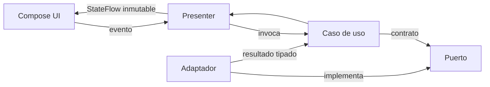

# Arquitectura móvil de My Keys

- **Estado de la decisión:** aceptada
- **Fecha:** 9 de septiembre de 2026
- **Sustituye:** React Native/Expo como cliente principal
- **Afecta a:** Fase 1 y todas las fases móviles posteriores

## Contexto

Fase 0 propuso React Native/Expo. Al construir la base se decidió priorizar una integración
más directa con Keystore, Keychain, biometría y futuras primitivas criptográficas sin
renunciar a compartir dominio y UI. El prototipo Expo ya creado se conserva como referencia,
pero no recibe la evolución funcional del producto.

## Decisión

My Keys adopta Kotlin Multiplatform con Compose Multiplatform. Android se renderiza con
Jetpack Compose nativo e iOS comparte la UI de Compose cuando no necesita una integración
específica de plataforma.

La arquitectura combina tres ideas compatibles:

- Clean Architecture para que dominio y casos de uso no dependan de frameworks.
- Flujo unidireccional de datos en presentación, con estado inmutable y eventos explícitos.
- Puertos y adaptadores en límites de seguridad y sistema operativo.

No se crea una capa por ceremonia. Las funcionalidades simples pueden ir de UI a caso de
uso y puerto; una capa de dominio adicional solo aparece cuando contiene reglas reutilizables
o complejas.

## Alternativas consideradas

### Continuar con Expo/React Native

Tenía una base operativa y un ciclo de desarrollo rápido. Se descartó como cliente principal
por el coste previsto de integrar y auditar los límites nativos sensibles del vault. Se
mantiene como prototipo para no perder sus componentes y evidencia visual.

### Dos clientes nativos independientes

Ofrecía el máximo control por plataforma, pero duplicaba dominio, flujos de autenticación,
UI y pruebas. No se justificó para un proyecto pequeño con reglas de negocio idénticas.

### Compartir solo dominio con KMP

Era viable, pero duplicaba toda la presentación. Compose Multiplatform permite compartirla
y seguir usando Jetpack Compose en Android, dejando escapes nativos donde sean necesarios.

## Consecuencias

- Las reglas sensibles se implementan y prueban una vez en `commonMain`.
- Android utiliza Compose sobre su runtime nativo; iOS aloja un `UIViewController` de
  Compose dentro de SwiftUI.
- Los adaptadores de plataforma siguen separados para custodia de claves, biometría,
  clipboard, lifecycle y cualquier API que no tenga semántica idéntica.
- El equipo asume la necesidad de validar cada release iOS en macOS/Xcode.
- El prototipo Expo aumenta temporalmente el volumen del repositorio, pero se identifica de
  forma explícita para evitar dos fuentes de verdad.

## Regla de dependencias

`presentation -> domain <- data/platform`

El dominio define qué necesita. Los adaptadores deciden cómo hacerlo. Por tanto, Supabase,
SQLDelight, Android Keystore, Apple Keychain, biometría y autofill no pueden importarse desde
el dominio.

Reglas comprobables:

- `domain` no importa Compose, Supabase, Ktor, Android ni iOS;
- `presentation` depende de casos de uso y modelos de dominio, no de adaptadores;
- `data` implementa puertos declarados por dominio;
- `androidMain` e `iosMain` contienen únicamente implementaciones específicas;
- la composición raíz es el lugar donde se conectan implementaciones concretas;
- ninguna UI recibe bytes de claves criptográficas ni tokens para mostrarlos o registrarlos.

## Módulos iniciales

- `androidApp`: aplicación Android y configuración de seguridad del sistema.
- `iosApp`: host iOS y puente a la UI compartida.
- `shared`: código común organizado por `domain`, `data`, `presentation` y `designsystem`.

Se dividirá `shared` en módulos Gradle separados solo cuando los límites crezcan lo suficiente
para que la compilación, ownership o aislamiento lo justifiquen. En Fase 1 los paquetes ya
marcan esos límites sin imponer coste estructural prematuro.

## Organización del código compartido

```text
shared/src/
├─ commonMain/
│  ├─ kotlin/app/mykeys/
│  │  ├─ domain/
│  │  │  ├─ model/
│  │  │  ├─ port/
│  │  │  └─ usecase/
│  │  ├─ data/
│  │  ├─ presentation/
│  │  ├─ designsystem/
│  │  └─ App.kt
│  └─ composeResources/
├─ commonTest/
├─ androidMain/
└─ iosMain/
```

Los paquetes pueden evolucionar por feature —por ejemplo `auth`, `vault` o `security`— sin
abandonar los límites. La estructura física solo debe cambiar cuando mejore aislamiento,
tiempos de compilación, ownership o visibilidad de APIs.

## Flujo unidireccional de datos



La UI no ejecuta llamadas de infraestructura ni modifica modelos compartidos. El presenter
serializa la intención del usuario, aplica el resultado a un estado inmutable y expone un
`StateFlow`. Las operaciones suspendibles se ejecutan en coroutines controladas por el host
de composición.

## Límites de seguridad previstos

- `CryptoPort`: Argon2id, AEAD, generación aleatoria y borrado best-effort de buffers.
- `SecureKeyStorePort`: wrapping de claves con Keystore/Keychain y política biométrica.
- `VaultRepository`: persistencia local de ciphertext y sincronización remota.
- `SessionPort`: autenticación Supabase separada de la contraseña maestra.
- `ClipboardPort`: copiado temporal y limpieza best-effort.

La UI nunca recibe una clave criptográfica. Los adaptadores remotos nunca reciben plaintext
del vault ni la contraseña maestra.

## División común/plataforma

Debe permanecer en código común:

- modelos e invariantes;
- casos de uso y puertos;
- estado y lógica de navegación de cada feature;
- componentes visuales que tengan el mismo comportamiento;
- serialización versionada independiente del almacenamiento concreto.

Debe permanecer en cada plataforma:

- Keystore/Keychain y política biométrica;
- integración de lifecycle/background;
- flags de captura de pantalla;
- clipboard y limpieza best-effort;
- deep links del shell y configuración del bundle/app;
- motores de red Ktor (`OkHttp`/`Darwin`);
- autofill y extensiones futuras.

## Composición en tiempo de ejecución

- `MainActivity` crea las dependencias Android y monta `App` con Compose.
- `iOSApp.swift` presenta `ContentView`, que aloja el controlador devuelto por
  `MainViewController`.
- `AuthComposition` construye almacenamiento seguro, cliente Supabase, adaptador, casos de
  uso y presenter sin usar un contenedor de inyección global.
- Los valores de entorno llegan desde `BuildConfig` en Android y `Info.plist`/xcconfig en
  iOS; el dominio no puede leerlos.

La composición manual se mantiene mientras el grafo sea pequeño. Una librería de DI solo se
justificaría cuando reduzca complejidad medible sin ocultar los límites sensibles.

## Versiones fijadas en Fase 1

- Kotlin 2.4.10.
- Compose Multiplatform 1.11.1.
- Android Gradle Plugin 9.1.0.
- Gradle 9.6.1 con checksum fijado.
- `compileSdk` y `targetSdk` 36; `minSdk` 26.

API 36 se mantiene mientras sea el último nivel estable probado por AGP 9.1. El SDK 37
preliminar puede estar instalado para evaluación, pero no define el target de producción.

Dependencias de Fase 2 añadidas sobre esta base:

- Ktor 3.4.3 (`OkHttp` en Android y `Darwin` en iOS);
- kotlinx-coroutines 1.10.2;
- kotlinx-serialization 1.11.0;
- supabase-kt Auth 3.6.0;
- QRose 1.1.2 para representar el enrolamiento TOTP localmente.

Las versiones se fijan en `gradle/libs.versions.toml`. No se usa una versión dinámica.

## Estrategia de pruebas

- `commonTest` cubre dominio, serialización y presenters mediante puertos falsos.
- `testAndroidHostTest` ejecuta el código común que participa en Android.
- Android Lint y warnings de compilación fallan el build.
- Las integraciones servidor se prueban por separado contra Supabase local.
- El build iOS debe ejecutarse en macOS antes de afirmar compatibilidad de una entrega.

## Criterios para crear nuevos módulos Gradle

La separación de `shared` se reconsiderará cuando se cumpla alguno de estos criterios:

- una feature sensible deba impedir imports internos de otra;
- los tiempos incrementales empeoren de forma medible;
- diferentes responsables necesiten ownership y API pública claros;
- una dependencia pesada de infraestructura contamine features que no la usan;
- se necesite publicar o probar un componente de manera independiente.

Hasta entonces, paquetes y visibilidad `internal` ofrecen el límite suficiente con menos
configuración.

## Restricciones pendientes

- La arquitectura iOS está implementada, pero no compilada en el entorno Windows actual.
- La selección final de biblioteca criptográfica pertenece a Fase 3 y deberá respetar
  `CryptoPort`/`SecureKeyStorePort`.
- La persistencia offline y sincronización del vault no se deciden en Fase 1.
- Cambiar estas reglas requiere actualizar este documento y registrar las consecuencias en
  la fase que adopte el cambio.
