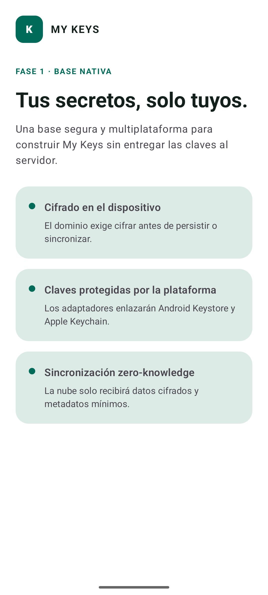
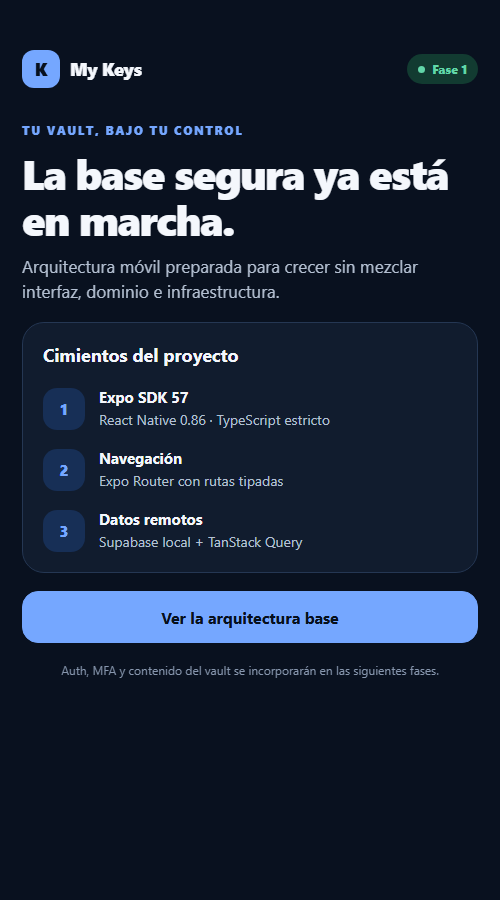
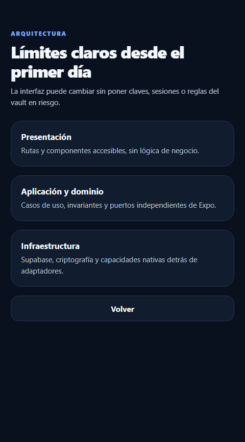

# My Keys — Fase 1: base

- **Estado:** completada en Windows/Android; build iOS diferido
- **Inicio:** 8 de septiembre de 2026
- **Cierre del alcance validable:** 9 de septiembre de 2026

## Objetivo

Construir una base móvil reproducible con Kotlin Multiplatform y Compose Multiplatform,
Jetpack Compose en Android, límites de seguridad explícitos y controles de calidad en CI.
El prototipo Expo permanece como referencia durante la migración.

## Documentos de la fase

- [Arquitectura móvil KMP](KMP-ARCHITECTURE.md): decisión, dependencias y límites.
- [Entorno y verificación](ENTORNO-Y-VERIFICACION.md): instalación, comandos, resultados
  esperados y particularidades de Windows.
- [Inventario de implementación](INVENTARIO-DE-IMPLEMENTACION.md): trazabilidad entre los
  entregables y los archivos del repositorio.
- [`assets/`](assets/): capturas verificadas de KMP/Android y del prototipo Expo.

## Base móvil principal

- Kotlin Multiplatform con Compose Multiplatform para Android e iOS.
- Jetpack Compose como renderer nativo de Android.
- Clean Architecture pragmática, flujo de datos unidireccional y puertos/adaptadores.
- Módulo `androidApp`, host `iosApp` y módulo `shared` organizado por dominio, datos,
  presentación y design system.
- Android Gradle Plugin 9.1.0, Kotlin 2.4.10, Compose Multiplatform 1.11.1 y Gradle
  9.6.1 con checksum fijado.
- API Android estable 36 como compile/target, mínimo API 26.
- Backup y transferencia de datos del sistema deshabilitados para todos los dominios de
  almacenamiento de la aplicación.
- APK debug, test de dominio y Android Lint estricto verificados.

Consulta [la decisión de arquitectura](KMP-ARCHITECTURE.md).

## Prototipo Expo conservado

- Expo SDK 57.0.21 con Expo Router 57.0.20, React Native 0.86.3, React 19.2.3 y
  New Architecture obligatoria.
- `expo-dev-client` y perfiles EAS separados para dispositivos y simulador iOS.
- Expo Router con rutas tipadas y una pantalla de arquitectura navegable.
- TypeScript estricto con comprobaciones adicionales.
- Tema semantico claro/oscuro y componentes `Screen`, `Button`, `Card`, `BrandMark` y
  `StatusPill`.
- Proveedor de TanStack Query y cliente Supabase de inicializacion diferida.
- Validacion de variables publicas; rechazo de HTTP fuera de desarrollo local.
- Supabase CLI fijado y proyecto local configurado sin secretos.
- Jest, React Native Testing Library, ESLint, Prettier, Expo Doctor y workflow de GitHub
  Actions.
- Export de produccion y escaneo automatico del bundle contra secretos de servidor, claves
  privadas y tokens JWT incrustados.

## Decisiones de Fase 0

El inicio de esta fase registró como aceptadas las decisiones 1, 2, 3 y 5 de la Fase 0. La
política de recuperación MFA quedó cerrada en Fase 2: se recomienda registrar un segundo
factor y no existe bypass por soporte, email o Recovery Key del vault.

## Uso local

Requisitos Android instalados en esta máquina:

- Android Studio Quail 4 (2026.1.4).
- Plugin oficial Kotlin Multiplatform 261.26222.147-AS.
- Temurin JDK 21 LTS (21.0.11 en la evidencia original de cierre).
- Android SDK 36, platform-tools, build-tools 36.0.0, emulator y una imagen Google Play.
- WSL 2.7.13 con Ubuntu 24.04.4 LTS y `systemd`.
- Docker Engine 29.8.0, Docker Compose 5.5.1 y Supabase CLI 2.111.0 dentro de WSL.
- macOS con Xcode para builds iOS.

```powershell
Set-Location mobile
.\gradlew.bat :androidApp:assembleDebug :shared:testAndroidHostTest :androidApp:lintDebug
```

Para verificar el prototipo Expo conservado:

```powershell
Set-Location ..
npm ci
npm run check
```

Para trabajar con Supabase local desde Windows:

```powershell
npm run supabase:start
npm run supabase:status
npm run supabase:stop
```

Los scripts enrutan automáticamente la CLI a Ubuntu y crean una red Docker cuyas
publicaciones se limitan a `127.0.0.1`. Studio queda en `http://127.0.0.1:54323`. La
publishable key local se obtiene con `npm run supabase:status`. No se deben copiar claves
`service_role` ni secretos de servidor a variables `EXPO_PUBLIC_*`.

La configuración `%UserProfile%\.wslconfig` mantiene WSL activo mientras Docker ejecuta
servicios. Al terminar una sesión de desarrollo, `npm run supabase:stop` detiene la pila y
`wsl --shutdown` libera por completo la memoria de WSL. La plantilla reproducible está en
`infra/windows/wslconfig-docker.ini`.

## Puerta de salida

- [x] Scaffold Expo/TypeScript y routing.
- [x] Development Builds configurados con `expo-dev-client` y perfiles EAS.
- [x] Tema y componentes base.
- [x] Configuracion Supabase local, env y CI.
- [x] Lockfile generado e instalacion limpia con `npm ci`.
- [x] Formato, lint, typecheck y tests verdes.
- [x] Bundle web de produccion compilado y sin secretos detectados.
- [x] Revision visual de las dos rutas base en tema oscuro y viewport compacto.
- [x] CNG/prebuild Android verificado: genera `app.mykeys.mobile`, integra
      `expo-dev-client` y registra los esquemas `mykeys` y `exp+my-keys`.
- [x] Decisión revisada: Kotlin Multiplatform + Compose sustituye a Expo como cliente
      principal; el prototipo queda como referencia de migración.
- [x] Android Studio Quail 4, SDK, emulador, JDK 21 y plugin KMP instalados.
- [x] Base KMP con Clean Architecture, UDF y puertos/adaptadores creada.
- [x] APK debug nativo generado (`app.mykeys.mobile`).
- [x] Test Android host del dominio verde (1/1).
- [x] Android Lint estricto verde.
- [x] WSL 2, Docker Engine y Supabase CLI instalados; `hello-world` verificado.
- [x] Pila local Supabase sembrada y sana: Studio, Auth y REST responden HTTP 200 y
      PostgreSQL acepta conexiones; todos los puertos publicados se limitan a localhost.
- [x] Expo Doctor completamente verde (21/21) usando el almacén de certificados del sistema
      de Node 22 para las consultas remotas de Expo.
- [x] Build de desarrollo Android verificada.
- [ ] Build de desarrollo iOS verificada en macOS/Xcode.
- [x] Aplicación instalada y revisada visualmente en el AVD `medium_phone`; proceso activo
      y `MainActivity` confirmada como `topResumedActivity`.

## Bloqueos del entorno actual

- Windows permite validar la generacion nativa Android, pero no genera el proyecto iOS;
  el build iOS nativo requiere macOS y Xcode.
- La ruta del workspace contiene `ñ`. AGP se ha validado con su excepción oficial de ruta;
  los procesos Java aislados se ejecutan mediante una unidad virtual ASCII para evitar una
  limitación de sockets AF_UNIX del entorno protegido de Windows.

## Auditoria de dependencias

`npm audit --omit=dev --audit-level=high` pasa sin vulnerabilidades altas o criticas. npm
reporta 14 moderadas concentradas en `decode-uri-component` (transitiva de Expo Router) y
`uuid` (transitiva del generador Xcode de Expo). La correccion automatica propone degradar
paquetes de Expo con cambios incompatibles, por lo que no se aplica `npm audit fix --force`.
Se revisaran las actualizaciones compatibles del SDK antes de Auth/deep links.

El alcance Windows/Android se considera cerrado. La casilla iOS permanece abierta como una
verificación diferida de plataforma y no bloquea el comienzo de las fases comunes ya
validadas en Android.

## Evidencia visual

### Aplicación principal KMP/Compose en Android



### Prototipo Expo: inicio



### Prototipo Expo: arquitectura base


