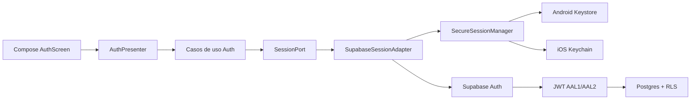
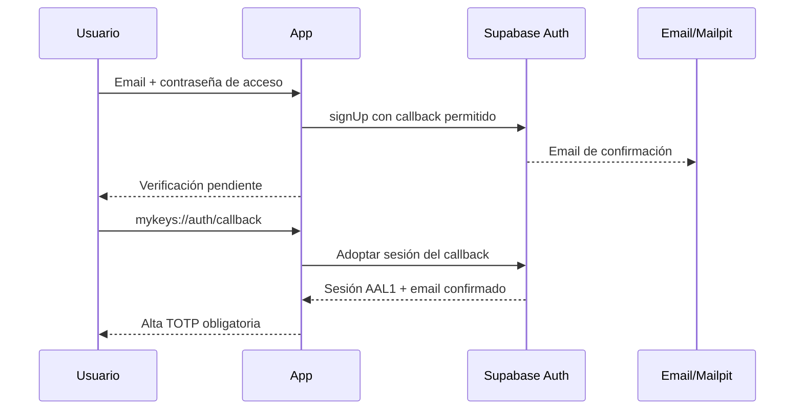

# Fase 2 — Arquitectura y flujos de identidad

## Propósito

La autenticación identifica la cuenta y eleva la sesión a AAL2. No desbloquea el vault ni
conoce la futura contraseña maestra. Supabase Auth recibe la contraseña de acceso; el futuro
módulo criptográfico será el único consumidor de la contraseña maestra.

## Componentes

- **Presentación:** `AuthUiState`, `AuthEvent`, `AuthScreen` y `AuthPresenter` implementan
  flujo unidireccional. La UI solo emite eventos y representa estado inmutable.
- **Dominio:** modelos, catálogo de fallos, validaciones y casos de uso. No importa Compose,
  Supabase, Ktor ni APIs de plataforma.
- **Puerto:** `SessionPort` expresa registro, login, recuperación, sesión y TOTP sin tipos
  del proveedor.
- **Adaptador remoto:** `SupabaseSessionAdapter` traduce el puerto a `supabase-kt` y
  convierte errores externos a `AuthFailure`.
- **Persistencia segura:** `SecureSessionManager` serializa el `UserSession` que necesita el
  SDK y delega el blob a `SecureAuthStorage`, implementado por Keystore en Android y
  Keychain en iOS.
- **Backend:** Auth emite la sesión; Postgres vuelve a comprobar AAL y propiedad mediante
  RLS para cada operación privada.

## Estados de dominio

`SessionStage` evita representar una sesión como un simple booleano:

- `Anonymous`: no existe sesión utilizable.
- `EmailVerificationRequired`: el alta necesita confirmación.
- `TotpEnrollmentRequired`: email confirmado, todavía sin TOTP verificado.
- `TotpChallengeRequired`: hay uno o varios factores y falta elevar a AAL2.
- `PasswordRecoveryMfaRequired`: el deep link de recuperación es válido, pero aún falta
  MFA.
- `PasswordRecoveryReady`: se permite introducir una contraseña de acceso nueva.
- `Authenticated`: sesión AAL2 lista para consultar datos propios.

La presentación proyecta estos estados sobre pantallas específicas. Si hay un único factor
verificado, pasa directamente al desafío; con varios muestra selección.

## Arranque y restauración de sesión

1. `App` emite `Restore` al iniciar.
2. El adaptador solicita a `SecureSessionManager` el blob protegido.
3. El manager comprueba que el JSON sea válido; el storage Android comprueba además la
   versión de su envoltura cifrada.
4. Supabase adopta la sesión y fuerza un refresh remoto, que detecta tokens caducados o
   revocados.
5. Se calcula `SessionStage` con email, factores y assurance level actuales.
6. Un blob corrupto se borra localmente; una sesión caducada/revocada se limpia cuando el
   refresh devuelve un error de sesión y el flujo conduce de nuevo al login.

La carga/guardado automático en preferencias del SDK se desactiva. El SDK no es la fuente
persistente de tokens.

## Registro y confirmación de email

Reglas locales:

- email normalizado con `trim` y minúsculas;
- formato de email validado antes de red;
- contraseña de acceso entre 12 y 128 caracteres;
- confirmación idéntica;
- mensaje de reenvío deliberadamente genérico para reducir enumeración.

## Login y elevación AAL2

1. El caso de uso valida email y credenciales no vacías.
2. Supabase autentica y entrega una sesión AAL1.
3. Si no hay TOTP verificado, My Keys conduce al alta.
4. Si existe uno, crea y verifica el desafío con seis dígitos.
5. Si existen varios, el usuario selecciona el factor antes del desafío.
6. Tras una verificación válida, se guarda la sesión actualizada y se confirma AAL2.
7. Solo entonces RLS permite leer o modificar filas privadas propias.

Ocultar pantallas no es una medida de autorización: un cliente modificado sigue encontrando
las políticas RLS del servidor.

## Alta y gestión TOTP

- El nombre del factor se recorta a 64 caracteres y usa `Authenticator` como fallback.
- Supabase genera el factor; la app muestra localmente URI, QR y secreto manual.
- El código se limita a seis dígitos y nunca se guarda como estado persistente.
- La lista expone solo factores TOTP verificados.
- Se permite registrar un factor adicional de respaldo.
- El dominio rechaza eliminar el último factor verificado.
- El trigger de base de datos aplica la misma regla aunque se intente el endpoint directo.
- Después de eliminar uno de varios factores se refresca la sesión para actualizar claims.

La pantalla actual no ofrece un evento de eliminación, pero el puerto, el adaptador, la
regla de dominio y la protección servidor están implementados y probados para el flujo de
gestión previsto.

## Recuperación de contraseña de acceso

1. La petición por email siempre produce un mensaje de UI genérico.
2. El enlace debe volver exactamente a `mykeys://auth/callback`.
3. La sesión de recovery comienza en AAL1.
4. Si existen factores verificados, la app obliga a completar TOTP.
5. Solo `PasswordRecoveryReady` permite enviar la contraseña nueva.
6. Un login posterior vuelve a empezar en AAL1 y requiere MFA de nuevo.

Este flujo recupera la cuenta, no el contenido cifrado. No conoce ni reemplaza la contraseña
maestra o la Recovery Key del vault.

## Contrato de deep links

- Esquema: `mykeys`.
- Host: `auth`.
- Ruta: `/callback`.
- Forma aceptada por dominio: `mykeys://auth/callback?...`.
- Android registra el intent filter en `AndroidManifest.xml`.
- iOS registra el esquema en `Info.plist`.
- Supabase local declara la URL como `site_url` y redirect permitido.

El adaptador vuelve a analizar esquema, host y ruta antes de entregar el URI al SDK. Un URI
que solo comparte el prefijo visual no es suficiente.

## Persistencia por plataforma

### Android

`AndroidSecureAuthStorage` genera o reutiliza una clave AES de 256 bits no exportable en
Android Keystore. Cada escritura usa AES-GCM con IV nuevo; `SharedPreferences` contiene solo
la versión, IV y ciphertext codificados. La aplicación desactiva backups y transferencia de
datos para impedir que ese blob viaje sin su clave hardware/OS.

### iOS

`IosSecureAuthStorage` usa un item genérico de Keychain asociado al bundle, accesible como
`AfterFirstUnlockThisDeviceOnly`. El valor no es migrable a otro dispositivo mediante
backup. La validación de build queda pendiente de macOS/Xcode.

## Errores y mensajes

El dominio expone un catálogo cerrado: email inválido, contraseña débil, mismatch,
credenciales inválidas, email pendiente/registrado, TOTP inválido, factor ausente, último
factor, sesión caducada, AAL insuficiente, deep link inválido, rate limit, red,
configuración, servicio y error inesperado.

La presentación traduce cada caso a texto seguro. No muestra cuerpos crudos de Supabase ni
diferencias que permitan confirmar la existencia de una cuenta en flujos de recuperación.
Las cancelaciones de coroutine se propagan y no se convierten en errores de negocio.

## Archivos principales

- `domain/model/AuthModels.kt`: sesión, factores, etapas y fallos.
- `domain/port/SessionPort.kt`: contrato independiente del proveedor.
- `domain/usecase/AuthUseCases.kt`: validaciones y operaciones.
- `data/auth/SupabaseSessionAdapter.kt`: integración Auth/MFA/deep links.
- `data/auth/SecureAuthStorage.kt`: formato y manager de sesión.
- `androidMain/.../AndroidSecureAuthStorage.kt`: Android Keystore.
- `iosMain/.../IosSecureAuthStorage.kt`: iOS Keychain.
- `presentation/auth/AuthContract.kt`: pantallas, estado, eventos y mensajes.
- `presentation/auth/AuthPresenter.kt`: máquina de presentación.
- `presentation/auth/AuthScreen.kt`: UI Compose compartida.

## Límites de esta arquitectura

- No contiene criptografía del vault.
- No persiste datos descifrados ni claves del vault.
- No resuelve pérdida de todos los TOTP.
- No garantiza revocación instantánea de un access token AAL2 ya emitido; su ventana local
  es de 15 minutos y se fuerza refresh después de gestionar factores.
- No sustituye la futura reautenticación servidor para acciones destructivas.
